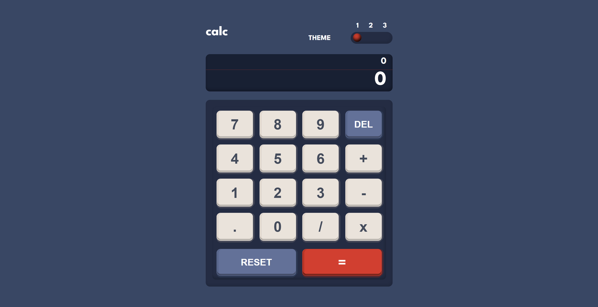

# Frontend Mentor - Calculator App Solution

This is a solution to the [Calculator app challenge on Frontend Mentor](https://www.frontendmentor.io/challenges/calculator-app-9lteq5N29). Frontend Mentor challenges help you improve your coding skills by building realistic projects.

## Table of Contents

- [Overview](#overview)
  - [The Challenge](#the-challenge)
  - [Screenshot](#screenshot)
  - [Links](#links)
- [My Process](#my-process)
  - [Built With](#built-with)
  - [Features](#features)
  - [What I Learned](#what-i-learned)
  - [Continued Development](#continued-development)
  - [Useful Resources](#useful-resources)
- [Author](#author)

## Overview

### The Challenge

Users should be able to:

- Perform mathematical operations like addition, subtraction, multiplication, and division.
- Adjust the color theme based on their preference.
- See the size of the elements adjust based on their device's screen size.

### Screenshot

### Links

- Solution URL: [Add your solution URL here](#)
- Live Site URL: [Add your live site URL here](#)

## My Process

### Built With

- Semantic HTML5 markup
- CSS custom properties
- Flexbox
- CSS Grid
- Mobile-first workflow
- [React](https://reactjs.org/) - JS library
- [Vite](https://vitejs.dev/) - Frontend Tooling
- [TypeScript](https://www.typescriptlang.org/) - Typed JavaScript

### Features

- **Calculator Functionality**: Perform basic arithmetic operations.
- **Theme Switcher**: Users can toggle between multiple themes to customize their experience.
- **Responsive Design**: Optimized for different screen sizes, ensuring usability across devices.
- **Keyboard Support**: Users can interact with the calculator using their keyboard.

### What I Learned

Working on this project, I enhanced my skills in:

- Managing state within a React application, especially handling complex calculations and theme switching.
- Implementing a responsive design using CSS Grid and Flexbox to ensure the calculator is functional and visually appealing on various devices.
- Creating an accessible and user-friendly theme switcher using local storage to persist user preferences.

# Frontend Mentor - Calculator App Solution

This is a solution to the [Calculator app challenge on Frontend Mentor](https://www.frontendmentor.io/challenges/calculator-app-9lteq5N29). Frontend Mentor challenges help you improve your coding skills by building realistic projects.

## Table of Contents

- [Overview](#overview)
  - [The Challenge](#the-challenge)
  - [Screenshot](#screenshot)
  - [Links](#links)
- [My Process](#my-process)
  - [Built With](#built-with)
  - [Features](#features)
  - [What I Learned](#what-i-learned)
  - [Continued Development](#continued-development)
  - [Useful Resources](#useful-resources)
- [Author](#author)

## Overview

### The Challenge

Users should be able to:

- Perform mathematical operations like addition, subtraction, multiplication, and division.
- Adjust the color theme based on their preference.
- See the size of the elements adjust based on their device's screen size.

### Screenshot

### Links

- Solution URL: [https://calculator-app-thebeyonder616.vercel.app/](#)
- Live Site URL: [https://calculator-app-thebeyonder616.vercel.app/](https://calculator-app-thebeyonder616.vercel.app/)

## My Process

### Built With

- Semantic HTML5 markup
- CSS custom properties
- Flexbox
- CSS Grid
- Mobile-first workflow
- [React](https://reactjs.org/) - JS library
- [Vite](https://vitejs.dev/) - Frontend Tooling
- [TypeScript](https://www.typescriptlang.org/) - Typed JavaScript

### Features

- **Calculator Functionality**: Perform basic arithmetic operations.
- **Theme Switcher**: Users can toggle between multiple themes to customize their experience.
- **Responsive Design**: Optimized for different screen sizes, ensuring usability across devices.
- **Keyboard Support**: Users can interact with the calculator using their keyboard.

### What I Learned

Working on this project, I enhanced my skills in:

- Managing state within a React application, especially handling complex calculations and theme switching.
- Implementing a responsive design using CSS Grid and Flexbox to ensure the calculator is functional and visually appealing on various devices.
- Creating an accessible and user-friendly theme switcher using local storage to persist user preferences.

### Continued Development

Future improvements could include:

- Adding more advanced mathematical functions.
- Improving accessibility features for better usability.
- Enhancing the UI with animations for a smoother experience.
- Implementing persistent user preferences using local storage.

### Useful Resources

- [Frontend Mentor Challenge](https://www.frontendmentor.io/challenges/calculator-app-9lteq5N29) - The challenge details and assets.
- [MDN Web Docs - Using CSS Grid](https://developer.mozilla.org/en-US/docs/Web/CSS/CSS_Grid_Layout/Basic_Concepts_of_Grid_Layout) - A comprehensive guide to CSS Grid.
- [React Documentation](https://reactjs.org/docs/getting-started.html) - Official React documentation.
- [CSS Tricks - Theme Switching](https://css-tricks.com/a-complete-guide-to-dark-mode-on-the-web/) - Guide on implementing dark mode and theme switching.

## Author

- Frontend Mentor - [@TheBeyonder616](https://www.frontendmentor.io/profile/TheBeyonder616)
- GitHub - [TheBeyonder616](https://github.com/TheBeyonder616)

### Continued Development

Future improvements could include:

- Adding more advanced mathematical functions.
- Improving accessibility features for better usability.
- Enhancing the UI with animations for a smoother experience.
- Implementing persistent user preferences using local storage.

### Useful Resources

- [Frontend Mentor Challenge](https://www.frontendmentor.io/challenges/calculator-app-9lteq5N29) - The challenge details and assets.
- [MDN Web Docs - Using CSS Grid](https://developer.mozilla.org/en-US/docs/Web/CSS/CSS_Grid_Layout/Basic_Concepts_of_Grid_Layout) - A comprehensive guide to CSS Grid.
- [React Documentation](https://reactjs.org/docs/getting-started.html) - Official React documentation.
- [CSS Tricks - Theme Switching](https://css-tricks.com/a-complete-guide-to-dark-mode-on-the-web/) - Guide on implementing dark mode and theme switching.

## Author

- Frontend Mentor - [@TheBeyonder616](https://www.frontendmentor.io/profile/TheBeyonder616)
- GitHub - [TheBeyonder616](https://github.com/TheBeyonder616)
